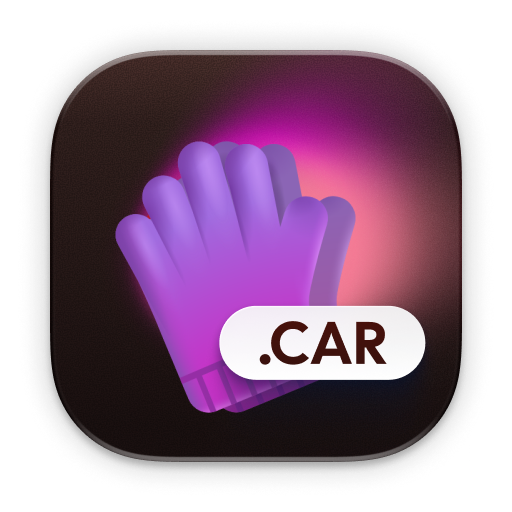
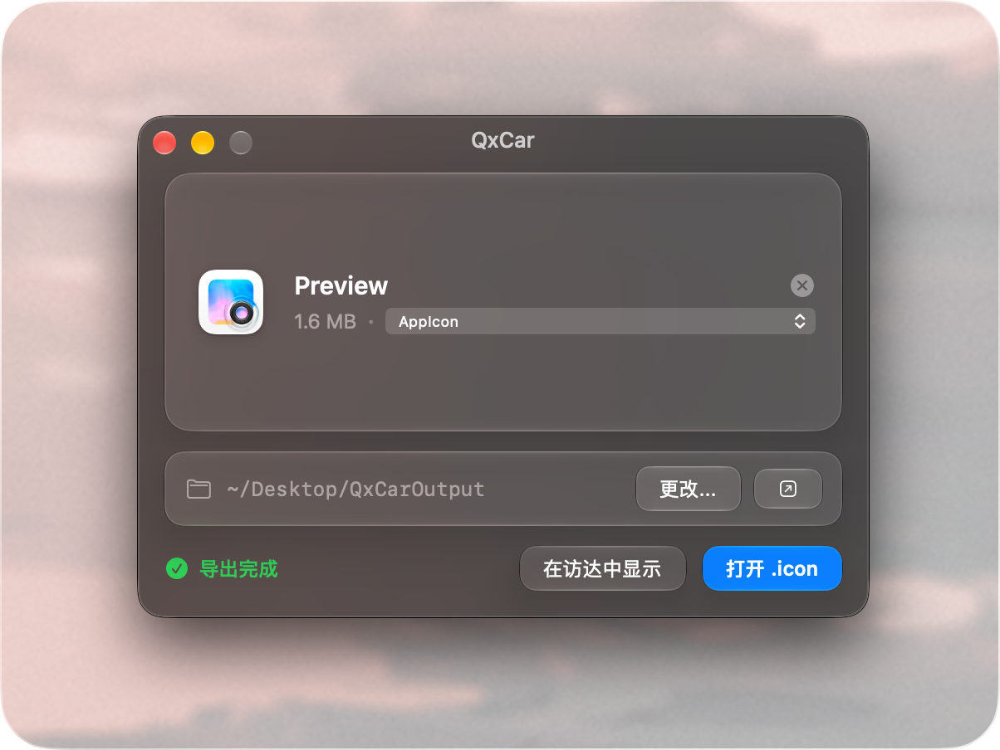

<div align="center">



# QxCar

**macOS 应用资产导出与 Liquid Glass（液态玻璃）`.icon` 逆向工程工具**

*UI 设计师与 macOS 开发者必备 · 一键提取 `Assets.car` 完整资产 · 逆向重构原生 `.icon` 源文件*

<p align="center">
  <a href="https://github.com/qzrzz/QxCar"></a>
  <a href="https://swift.org"></a>
  <a href="https://bun.sh"></a>
  <a href="LICENSE"></a>
  <a href="https://github.com/qzrzz/QxCar/releases"></a>
</p>

[🌐 官方网站](https://qzrzz.com/QxCar) · [📥 立即下载](https://download.qzrzz.com/QxCar) · [📖 架构说明](DEV.md) · [💡 报告建议与反馈](https://github.com/qzrzz/QxCar/issues)

<br />



</div>

---

## ✨ 核心特性

- 🔮 **Liquid Glass 现代美学**：采用液态玻璃窗口质感、半透明折射材质与微光交互卡片。
- 📦 **智能拖拽识别**：直接拖入 `.app` 应用程序包或 `Assets.car` 资源文件，自动递归定位资产并解析应用图标堆栈（如 `AppIcon`）。
- 🎨 **全量资产导出**：一键将全部 PNG（1x/2x/3x）、矢量图（SVG）、PDF 文档与调色板颜色表批量导出。
- 🪄 **.icon 源文件逆向重构**：将编译后的图标逆向重构为原生 `.icon` 文件夹与 `icon.json`，保留完整图层层级、外观特化（Light / Dark / Tinted）、折射与高光参数，可直接在 Apple 官方 **Icon Composer** 中打开与二次编辑。

---

## 🛠️ 技术实现与构建开发

### 🔬 底层技术与逆向原理

- **私有框架动态桥接**：通过动态载入 macOS 系统的 `CoreUI` 与 `CoreSVG` 私有框架，深度解析编译后的 `IconImageStack` 与二进制资产。
- **逆向重构模型**：参考 `decant` 逆向算法，精确还原多外观特化（Light / Dark / Tinted Specializations）、图层混合模式（Blend Mode）、缩放位移变换（Scale & Translation）、高光位置（Specular Location）与玻璃折射率（Refractivity）等参数。
- **自动化校验**：支持调用 Apple `actool` 对生成的资产与 `.icon` 进行实时自动化校验。

### 🚀 工程化构建脚本

项目使用 `bun` 作为包管理与构建脚本运行工具：

```bash
# 启动开发调试模式 (自动构建并启动 App)
bun run dev

# 本地 Release 构建：签名、打 DMG / ZIP，不发布
bun run build
bun run build -- 1.0.1

# 正式发布：公证后经 QRls 发到 R2，默认镜像 GitHub
bun run release
bun run release -- 1.0.1

# 运行单元测试
bun run test
```

---

## 💻 目录结构

```
QxCar/
├── Package.swift                    # Swift PM 工程配置
├── package.json                     # Bun 依赖与脚本配置
├── scripts/                         # 自动化构建与发布脚本 (TypeScript)
│   ├── build-app.ts                 # App 打包、嵌入 Sparkle 与代码签名
│   ├── dev.ts                       # 开发模式启动器
│   ├── release.ts                   # 签名、公证、DMG / Sparkle、QRls 发布
│   ├── qrls-publish.ts              # QRls 上传到 R2 / GitHub
│   ├── generate-appcast.ts          # Sparkle generate_appcast 封装
│   ├── version.ts                   # 版本与构建编号管理
│   └── clean.ts                     # 缓存清理
├── Sources/
│   ├── QxCarCoreBridge/             # CoreUI & CoreSVG 私有框架动态桥接层
│   ├── QxCarCore/                   # 核心服务 (发现、素材导出、.icon 逆向引擎)
│   └── QxCar/                       # SwiftUI 主界面与 Liquid Glass 视图组件
└── Tests/
    └── QxCarCoreTests/              # 核心单元测试
```

---

## 📄 License
GPL-3.0 license.
